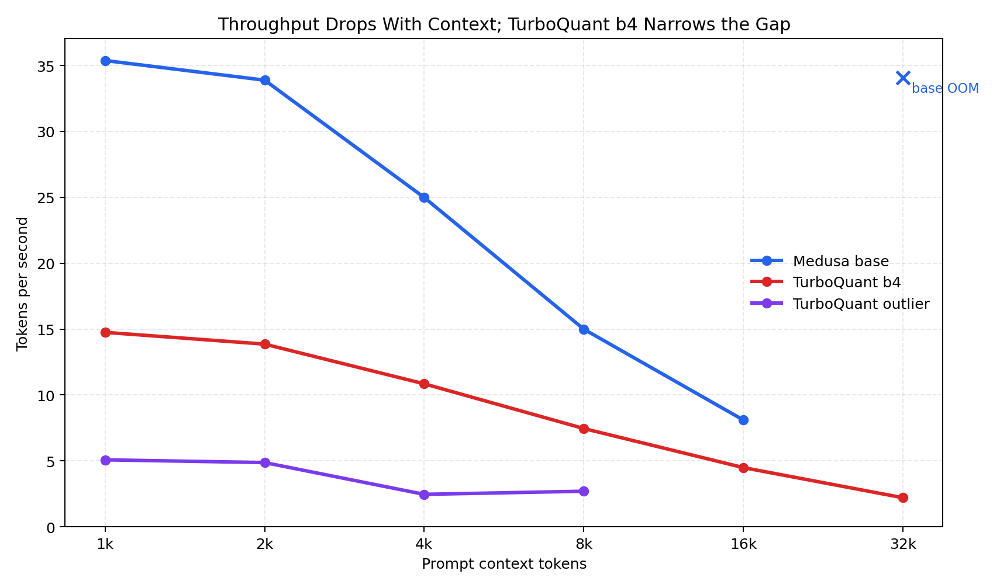
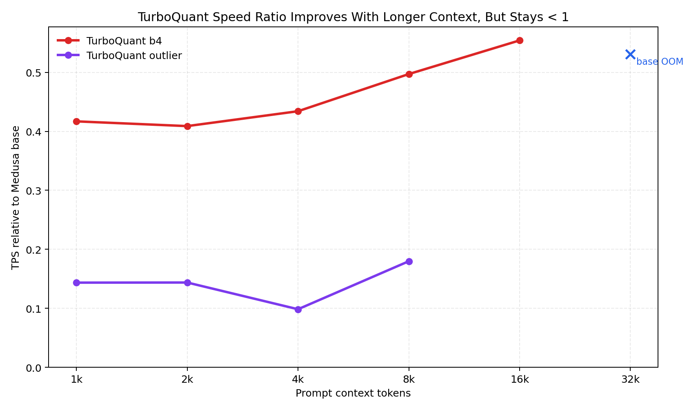
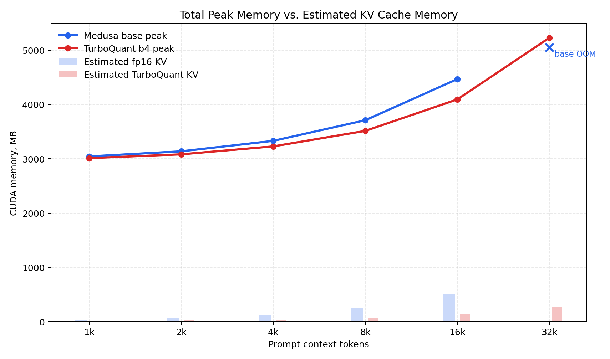
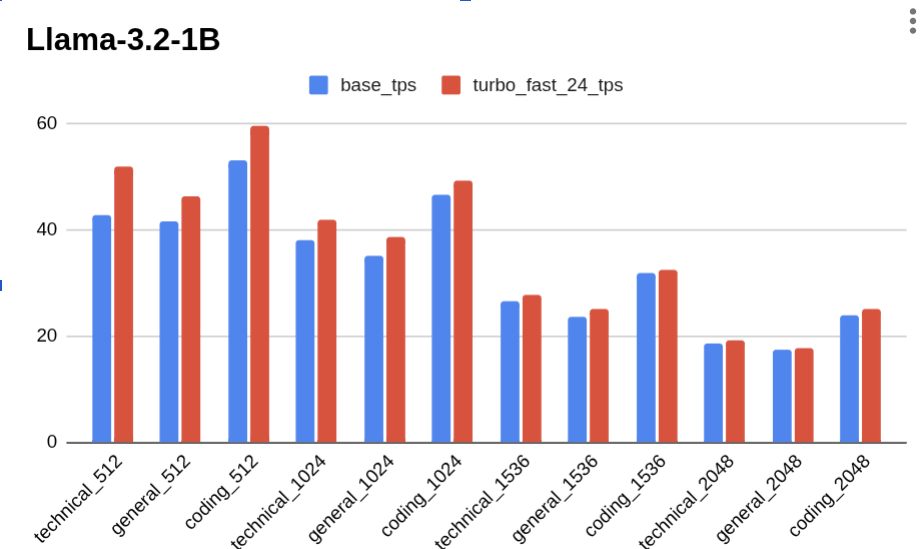
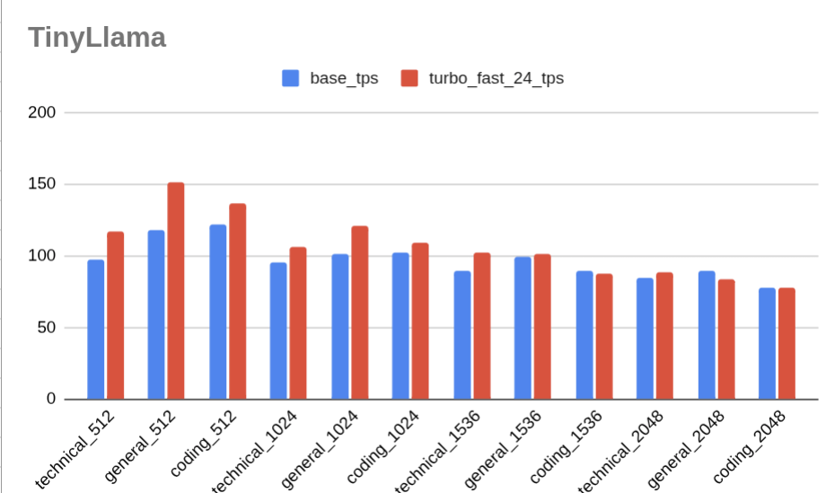

# TurboQuant Context Sweep Findings

Measured locally on the RTX 3060 Laptop GPU with 32 generated tokens per context point.
The 32k baseline was attempted with the same allocator setting as TurboQuant and OOMed during initial prompt prefill.

## Plots

## Key Measurements

| Context | Base TPS | TurboQuant b4 TPS | Speed Ratio | Base Peak MB | Turbo Peak MB | Peak Saved MB | Est. KV Saved MB |
|---:|---:|---:|---:|---:|---:|---:|---:|
| 1,024 | 35.37 | 14.75 | 0.417 | 3043.0 | 3010.8 | 32.2 | 24.8 |
| 2,048 | 33.88 | 13.86 | 0.409 | 3136.8 | 3081.1 | 55.7 | 47.1 |
| 4,096 | 24.98 | 10.84 | 0.434 | 3329.3 | 3227.5 | 101.9 | 92.7 |
| 8,192 | 14.99 | 7.45 | 0.497 | 3709.0 | 3512.8 | 196.2 | 183.9 |
| 16,384 | 8.10 | 4.49 | 0.554 | 4466.8 | 4093.0 | 373.8 | 366.4 |
| 32,768 | OOM | 2.20 | N/A | OOM | 5227.5 | N/A | 730.2 |

## Why Speedup Is Not Showing Yet

- The benchmark reports total generation speed, not isolated KV-cache bandwidth.
- Model weights, logits, Medusa tree verification, CUDA allocator behavior, and temporary attention tensors dominate short and medium contexts.
- The current TurboQuant path stores KV compressed, but the readable reference attention path still decodes K/V ranges into dense tensors before attention.
- TurboQuant also keeps a recent exact hot window for correctness and fast recent-token access, so memory is compressed plus a small fp16/bf16 tail.
- Compression adds encode/decode/QJL overhead. On this implementation, that overhead is larger than the memory-bandwidth saving up to 16k.
- At 32k, the result changes from a speed question to a capacity question: baseline OOMs on this 6 GB GPU, while TurboQuant b4 completes.

## 32k Capacity Result

With `PYTORCH_CUDA_ALLOC_CONF=expandable_segments:True`, TurboQuant b4 completed the 32k prompt at 2.20 TPS and 5227.5 MB peak allocation. The baseline run OOMed during initial prompt prefill while trying to allocate another 502 MB.

## Larger-Context Estimate

This estimate fits a simple linear time-vs-context trend to the measured larger points. It is a rough projection of the current implementation, not a measured result. Because 32k already puts TurboQuant near the 6 GB GPU limit, 64k+ would likely need 8-bit loading, chunked prefill, a smaller tree, or a GPU with more VRAM.

| Context | Est. Base TPS | Est. Turbo TPS | Est. Speed Ratio | Est. KV Saved MB |
|---:|---:|---:|---:|---:|
| 65,536 | 2.18 | 1.13 | 0.519 | 1460.3 |
| 131,072 | 1.11 | 0.57 | 0.518 | 2920.7 |

Expected outcome with the current code: memory savings should grow close to linearly with context, but throughput likely remains below baseline until the dense decode/reference attention path is fused or avoided.

## Plots
Speedup from tree size Reduction (different finding, one presented during class

