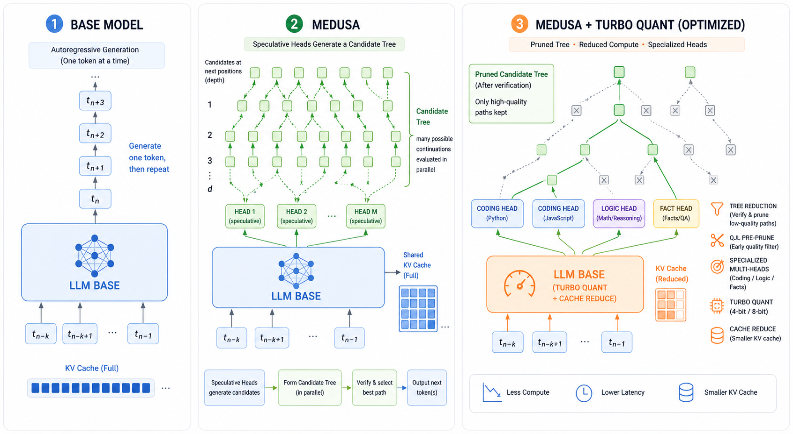
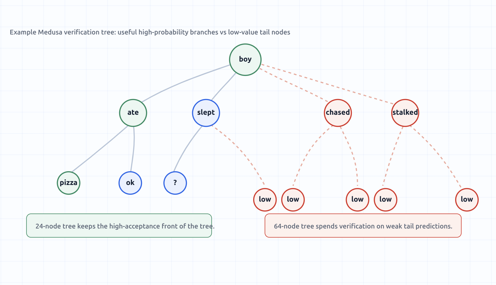
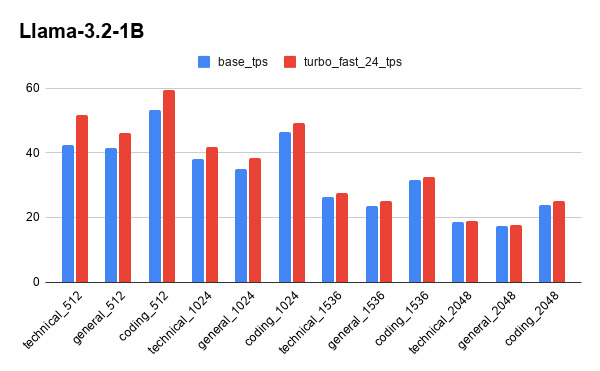
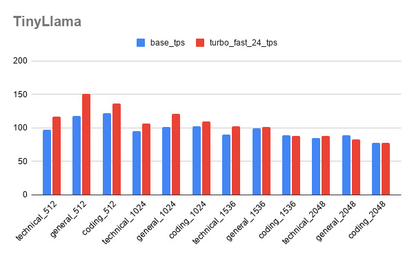

#### Muhammad Shaffan Ahamd (23i-0673) & Hamza Tariq (23i-0519)

# Turbo Medusa Minnions Task-Aware Heads and Turbo-Quantized KV Caches



This report summarizes three project findings:

1. TurboQuant KV-cache compression on top of base Medusa.
2. Custom speculative tree sizing instead of always using the full 63/64-node tree.
3. Multi Minnions: multiple niche-specific speculative decoding head packs.

The local long-context measurements were run on an RTX 3060 Laptop GPU with 6 GB VRAM and 32 generated tokens per context point. The 32k baseline was attempted with the same allocator setting as TurboQuant and OOMed during initial prompt prefill.

## Motivation

Autoregressive LLM decoding is serial: each new token normally needs a full target-model step. Medusa improves this by adding lightweight heads that draft multiple future tokens and verify a token tree in parallel. At longer context windows, however, the KV cache grows linearly with context length, tree verification can become unnecessarily expensive, and one generic head pack may not be equally good for coding, chat, summarization, and reasoning.

Our work therefore targets three bottlenecks:

- Reduce long-context KV memory pressure with TurboQuant.
- Improve throughput on long context chats through TurboQuant reduced cache communication and QJL Pre pruning.
- Reduce wasted tree verification by choosing model/task-specific tree sizes.
- Improve draft quality by training small specialized head packs, called Multi Minnions.


## SOTA Summary

| Work | Core idea | Relevance to this project | Gap we target |
|---|---|---|---|
| Speculative Decoding / Speculative Sampling | Use a cheaper draft model and verify several tokens with the target model. Reported 2x-3x style gains in early work. | Establishes draft-and-verify as the main latency reduction pattern. | Requires a good draft model and can add model-management cost. |
| SpecInfer | Builds and verifies a speculative token tree. | Closest systems-level ancestor of Medusa-style tree verification. | Tree size must be hardware and acceptance aware. |
| Medusa | Adds multiple draft heads directly to the target model and verifies candidate trees. | Base system used in this repo. | Fixed/default trees and generic heads are not always optimal. |
| Hydra | Makes draft heads sequentially dependent to improve Medusa-style speculation quality. | Supports the idea that head architecture and conditioning matter. | We explore specialization by domain rather than only dependency structure. |
| EAGLE | Drafts in feature space for strong speculative acceptance. | Shows stronger draft representations can outperform simple heads. | More complex drafting can be harder to train/deploy locally. |
| PagedAttention / vLLM | Manages KV cache blocks to reduce serving fragmentation. | Orthogonal memory-management direction. | Does not compress the numerical KV vectors themselves. |
| KVQuant / KIVI | Sub-4-bit KV-cache quantization using per-channel, pre-RoPE, outlier-aware, or asymmetric 2-bit layouts. | Sets strong SOTA baselines for long-context KV compression. | Accuracy and speed depend on metadata layout, calibration, and custom kernels. |
| PolarQuant / QJL / TurboQuant | PolarQuant removes scale overhead with polar transforms; QJL adds 1-bit unbiased residual correction; TurboQuant combines near-optimal quantization with QJL. | Most direct SOTA context for the TurboQuant-Medusa implementation. | Reported speedups require fused compressed-attention kernels; our path still decodes temporary dense K/V. |

## 1. TurboQuant Implementation and Findings

Our implementation stores KV vectors in compressed form using random rotation, scalar quantization, per-token scale metadata, and a 1-bit QJL residual correction for keys. The intended behavior is:

```text
new fp16 K/V -> encode once -> store compressed cache
attention read -> decode temporary K/V view -> verify/generate
compressed cache remains stored
```

This means TurboQuant is currently a capacity win first. It does not yet become a throughput win because the attention path still materializes dense temporary K/V tensors before verification.

Turbo Quant not only provides 3-5 times KV cache size reduction, in addition it provide lower peak allocation of GPU memory thus allowing to have longer context windows than base Medusa. In future if the first pass is offloaded to CPU, the peak allocation may fall further.

It can be observed that as the context increases, which is the practical scenario, the TPS falls drastically for the base model, while decreasing a little for the turbo medusa. Once kernel are fused it can not only outperform the base rather also stay scalable.


### Key Measurements

| Context | Base TPS | TurboQuant b4 TPS | Speed Ratio | Base Peak MB | Turbo Peak MB | Base KV Cache MB | Turbo KV Cache MB |
|---:|---:|---:|---:|---:|---:|---:|---:|
| 1,024 | 35.37 | 14.75 | 0.417 | 3043.0 | 3010.8 | 34.2 | 9.3 |
| 2,048 | 33.88 | 13.86 | 0.409 | 3136.8 | 3081.1 | 64.8 | 17.7 |
| 4,096 | 24.98 | 10.84 | 0.434 | 3329.3 | 3227.5 | 127.6 | 34.9 |
| 8,192 | 14.99 | 7.45 | 0.497 | 3709.0 | 3512.8 | 253.1 | 69.2 |
| 16,384 | 8.10 | 4.49 | 0.554 | 4466.8 | 4093.0 | 504.3 | 137.9 |
| 32,768 | OOM | 2.20 | N/A | OOM | 5227.5 | 1005.0 | 274.8 |

### Why Speedup Is Not Showing Yet

- The reported TPS measures the whole Medusa generation loop, not isolated KV-cache bandwidth.
- Model weights, logits, Medusa tree verification, temporary tensors, and CUDA allocator behavior dominate short and medium contexts.
- The current TurboQuant attention path stores compressed KV but decodes K/V ranges into dense tensors before attention.
- A recent exact hot window is also retained for correctness and recent-token verification.
- Encode/decode/QJL overhead is paid every step, while the memory-bandwidth saving only dominates at larger contexts or with fused compressed-attention kernels.

### Practical Improvement Over Base Medusa

The important local win is capacity:


##### 16k: base Medusa fits, TurboQuant fits with about 374 MB lower peak allocation.
##### 32k: base Medusa OOMs, TurboQuant b4 completes at 2.20 TPS.


So the current implementation does not beat base Medusa in raw TPS on the RTX 3060 laptop, but it enables a larger context window on the same 6 GB GPU. This is meaningful for constrained hardware.

### Larger-Context Expectation

With the current implementation, memory savings should grow roughly linearly with context length. Throughput is expected to move closer to the base or even higher on longer context. Since 32k already puts TurboQuant near the 6 GB GPU limit, 64k+ likely needs at least one of:

- fused compressed KV attention,
- chunked prefill,
- 8-bit or 4-bit model loading,
- smaller/adaptive trees,
- or a larger GPU such as the RTX 3080.

Fused kernel will reduce the compute overhead of decoding thus showing real speedup while providing reduced KV cache and peak allocation.

## 2. Custom Tree Size Findings



The default full tree is not universally best. Larger trees increase candidate coverage, but they also increase verification work. If head quality or task predictability is not high enough, many of those extra nodes do not translate into accepted tokens.


### Tree Sweep Summary

| Model / setting | 64-node/full tree max TPS | 24-node/custom tree max TPS | Finding |
|---|---:|---:|---|
| TinyLlama final sweep | 121.79 TPS | **151.17 TPS** | The 24-node tree gave the best observed max TPS, about **1.24x** over the 64-node/full-tree run. |
| Llama-3.2 final sweep | 53.13 TPS | **59.60 TPS** | The 24-node tree gave the best observed max TPS, about **1.12x** over the 64-node/full-tree run. |
| Quick calibration sweep | 108.40 TPS | **129.04 TPS** | The 24-node setting also won in the quick calibration run, about **1.19x** over the 64-node/full-tree max. |

Existing plots from the sweep:





### Interpretation

The correct tree size is a model-and-task parameter, not a constant. For this repo, the better policy is:

- sweep candidate limits such as 8, 16, 24, 32, 40, and 63/64,
- compare TPS, accepted tokens per step, and prefix match,
- use adaptive trees when aggressive small trees reduce output match,
- treat 64 nodes as a fallback, not the default answer.

## 3. Multi Minnions: Niche-Specific Speculative Heads

Medusa heads are small compared with the base model. That makes them cheap to train and easy to swap. The Multi Minnions idea is to train multiple small head packs, each specialized for a narrow workload:

```text
base LLM
  + coding Minnion heads
  + chat Minnion heads
  + summarization Minnion heads
  + reasoning Minnion heads
  + domain/tool-use Minnion heads
```

At inference time, a lightweight router selects the head pack based on prompt type, or the user explicitly chooses one. The base model remains unchanged.

### Why This Helps

- Specialized data lowers the entropy of the next-token distribution seen by the heads.
- Heads can learn local continuation patterns for code, APIs, error messages, or structured answers more easily than a universal head.
- Training is cheaper than fine-tuning the whole model or maintaining separate draft models.
- Multiple head packs allow deployment tradeoffs: a reliable general head plus faster niche heads for frequent workloads.

### Local Evidence

The code-specialized Llama-3.2 Medusa heads reached a validation score of 0.410 on the coding corpus with head top-1 accuracies:

```text
head1 40.4%, head2 22.1%, head3 14.7%, head4 10.7%
```

The earlier mixed Llama-3.2 head run logged a score of 0.174. The result supports the direction: niche heads can be trained efficiently and can become much stronger on their target domain.

Not only this approach requires less data set, but less compute, and less time as we were able to achieve the 40.4% acceptance upon < 2 hours of training on the rtx 3080 10 GB GPU for coding neche.

## Final Takeaways

1. TurboQuant works as a KV capacity extension for base Medusa. It enabled 32k context on the local 6 GB GPU where the baseline OOMed.
2. Raw speedup is not visible yet because the implementation still decodes temporary dense K/V and lacks fused compressed attention.
3. Tree size should be calibrated. Full 63/64-node trees are not consistently optimal across Vicuna-7B, TinyLlama, and Llama-3.2.
4. Multi Minnions is the most promising training-side idea: keep the base model fixed, train small specialized head packs, and route prompts to the best head niche.

## References

- Leviathan, Kalman, Matias. [Fast Inference from Transformers via Speculative Decoding](https://arxiv.org/abs/2211.17192), 2023.
- Chen et al. [Accelerating Large Language Model Decoding with Speculative Sampling](https://arxiv.org/abs/2302.01318), 2023.
- Miao et al. [SpecInfer: Accelerating Generative Large Language Model Serving with Tree-based Speculative Inference and Verification](https://arxiv.org/abs/2305.09781), 2023.
- Kwon et al. [Efficient Memory Management for Large Language Model Serving with PagedAttention](https://arxiv.org/abs/2309.06180), 2023.
- Cai et al. [Medusa: Simple LLM Inference Acceleration Framework with Multiple Decoding Heads](https://arxiv.org/abs/2401.10774), 2024.
- Li et al. [EAGLE: Speculative Sampling Requires Rethinking Feature Uncertainty](https://arxiv.org/abs/2401.15077), 2024.
- Ankner et al. [Hydra: Sequentially-Dependent Draft Heads for Medusa Decoding](https://arxiv.org/abs/2402.05109), 2024.
- Hooper et al. [KVQuant: Towards 10 Million Context Length LLM Inference with KV Cache Quantization](https://arxiv.org/abs/2401.18079), 2024.
- Liu et al. [KIVI: A Tuning-Free Asymmetric 2bit Quantization for KV Cache](https://arxiv.org/abs/2402.02750), 2024.
- Zandieh et al. [QJL: 1-Bit Quantized JL Transform for KV Cache Quantization with Zero Overhead](https://arxiv.org/abs/2406.03482), 2024.
- Han et al. [PolarQuant: Quantizing KV Caches with Polar Transformation](https://arxiv.org/abs/2502.02617), 2025.
- Zandieh et al. [TurboQuant: Online Vector Quantization with Near-optimal Distortion Rate](https://arxiv.org/abs/2504.19874), 2025.
